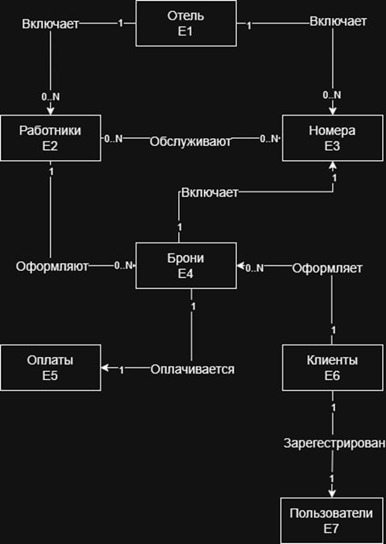

# Trade APP

Учебный проект, показывающий возможности взаимодействия web приложения и БД PostgreSQL с использованием ORM Sequelize. [cite_start]Проект предполагает определение БД из 6 таблиц[cite: 219, 220].

## Схема Базы Данных



## Инструкции по установке

[cite_start]Для запуска проекта необходимо выполнить установку зависимостей[cite: 7, 8].

```bash
npm install